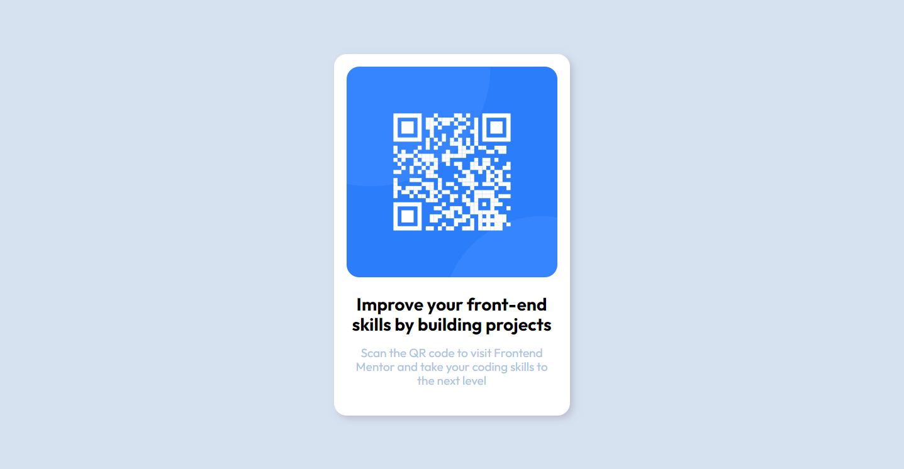

# Frontend Mentor - QR code component solution

This is a solution to the [QR code component challenge on Frontend Mentor](https://www.frontendmentor.io/challenges/qr-code-component-iux_sIO_H). Frontend Mentor challenges help you improve your coding skills by building realistic projects. 

## Table of contents

- [Overview](#overview)
  - [Screenshot](#screenshot)
  - [Links](#links)
  - [Built with](#built-with)
- [Author](#author)

## Overview

### Screenshot

### Links

- Live Site URL: [click here](https://virusse7.github.io/QR-code/)

### Built with

- Semantic HTML5 markup
- CSS custom properties
- Flexbox
- MediaQueries
- BEM convention

## Author

- Website - [virusse7](https://github.com/virusse7)
- Frontend Mentor - [virusse7](https://www.frontendmentor.io/profile/virusse7)

